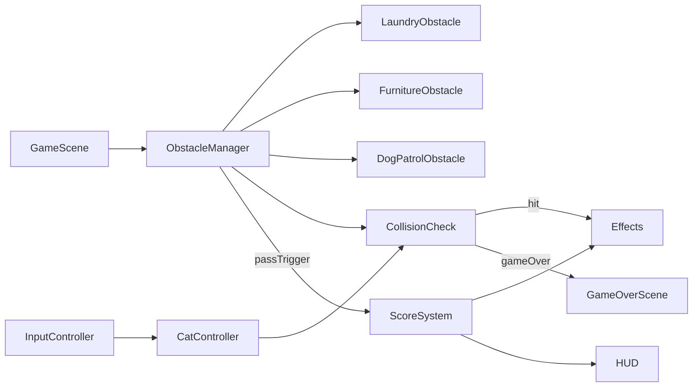

# Flappy Cat Phaser Implementation Plan

## Scope And Outcome
Create a playable browser game in `ai-playground/flappy_cat` using Phaser 3 and JavaScript, with:
- Cat movement (gravity + jump impulse), tilt-based animation, and expressive bounce/idle feel
- Three obstacle families: Laundry Chaos, Furniture Maze, Dog Patrol Zones
- Score tracking, best score persistence, start and game-over overlays, restart flow
- Polished feel: tuned physics, collision screen shake, score particles, gradual speed increase
- Extensible architecture so new obstacle types can be registered with minimal scene changes

## Proposed File Structure
- [ai-playground/flappy_cat/package.json](ai-playground/flappy_cat/package.json) (Vite scripts + Phaser dependency)
- [ai-playground/flappy_cat/index.html](ai-playground/flappy_cat/index.html) (game mount)
- [ai-playground/flappy_cat/src/main.js](ai-playground/flappy_cat/src/main.js) (Phaser boot + config)
- [ai-playground/flappy_cat/src/scenes/BootScene.js](ai-playground/flappy_cat/src/scenes/BootScene.js) (procedural textures/colors and shared setup)
- [ai-playground/flappy_cat/src/scenes/MenuScene.js](ai-playground/flappy_cat/src/scenes/MenuScene.js) (start screen + play button)
- [ai-playground/flappy_cat/src/scenes/GameScene.js](ai-playground/flappy_cat/src/scenes/GameScene.js) (core loop, physics hookups, scoring)
- [ai-playground/flappy_cat/src/scenes/GameOverScene.js](ai-playground/flappy_cat/src/scenes/GameOverScene.js) (final score, best score, restart)
- [ai-playground/flappy_cat/src/game/CatController.js](ai-playground/flappy_cat/src/game/CatController.js) (input + cat physics + tilt animation)
- [ai-playground/flappy_cat/src/game/ObstacleManager.js](ai-playground/flappy_cat/src/game/ObstacleManager.js) (spawn scheduler, registry, cleanup, difficulty scaling)
- [ai-playground/flappy_cat/src/game/obstacles/LaundryObstacle.js](ai-playground/flappy_cat/src/game/obstacles/LaundryObstacle.js)
- [ai-playground/flappy_cat/src/game/obstacles/FurnitureObstacle.js](ai-playground/flappy_cat/src/game/obstacles/FurnitureObstacle.js)
- [ai-playground/flappy_cat/src/game/obstacles/DogPatrolObstacle.js](ai-playground/flappy_cat/src/game/obstacles/DogPatrolObstacle.js)
- [ai-playground/flappy_cat/src/game/ScoreSystem.js](ai-playground/flappy_cat/src/game/ScoreSystem.js) (score updates + localStorage best)
- [ai-playground/flappy_cat/src/game/InputController.js](ai-playground/flappy_cat/src/game/InputController.js) (space/touch abstraction)
- [ai-playground/flappy_cat/src/game/Effects.js](ai-playground/flappy_cat/src/game/Effects.js) (screen shake + score particles)
- [ai-playground/flappy_cat/src/styles.css](ai-playground/flappy_cat/src/styles.css) (soft palette + simple UI skin)
- [ai-playground/flappy_cat/README.md](ai-playground/flappy_cat/README.md) (run instructions + extension guide)

## Architecture Design
- `GameScene` orchestrates systems and remains lean: calls update methods, handles state transitions only.
- `CatController` owns cat body, jump impulse, gravity tuning, angle interpolation (`up tilt` on jump, `down tilt` while falling).
- `ObstacleManager` exposes a plugin-like registration model:
  - obstacle definitions provide `spawn(scene, x, difficulty)` and return colliders/score trigger zones
  - weighted random selection rotates obstacle families while respecting difficulty phase
- `ScoreSystem` centralizes score and emits events for UI + particles.
- `Effects` listens to game events (`score`, `hit`) and plays polish effects.

## Obstacle Behavior Plan
- Laundry Chaos:
  - Top and bottom hanging lines with cloth sprites swaying using sinusoidal tween offsets
  - Random subset gains vertical bobbing to create changing gap timing
- Furniture Maze:
  - Mixed blocks (sofa/chair/table silhouettes) with procedural stacked layouts
  - Gap width narrows slowly with difficulty; stack patterns vary by seed
- Dog Patrol Zones:
  - Static sleeping-dog hazard and occasional patrolling dog moving vertically or short horizontal sweeps
  - Distinct collision boxes and visual cue animation so hazards feel readable but tense

## Gameplay Polish Tuning
- Physics defaults (to be playtested): moderate gravity, sharp jump impulse, capped downward velocity.
- Difficulty ramp every few seconds:
  - world scroll speed increases gradually
  - spawn interval reduces slightly
  - obstacle pattern complexity rises (more moving elements)
- Collision feedback:
  - short camera shake + brief hit flash
  - optional tiny burst particles on successful score trigger

## UX Plan
- Menu scene:
  - game title, fun subtitle, Play button, optional tip line (`Space or tap to jump`)
- In-game HUD:
  - centered top score counter
- Game-over scene:
  - final score, best score from localStorage, Restart and Menu buttons

## Validation Steps
- Launch via Vite and verify no runtime errors
- Verify controls: keyboard and touch/click both trigger jump
- Verify each mandatory obstacle family spawns and can cause collision
- Verify score increments only when cat fully passes scoring trigger
- Verify best score persists across refresh
- Verify difficulty is noticeable but fair over ~60 seconds

## Future Stretch Hooks
- Add optional modules under `src/game/features` for skins, day/night cycle, and SFX without modifying core controllers.
- Extend `ObstacleManager` registry to include bonus hazards (laser, yarn, vacuum) as drop-in classes.