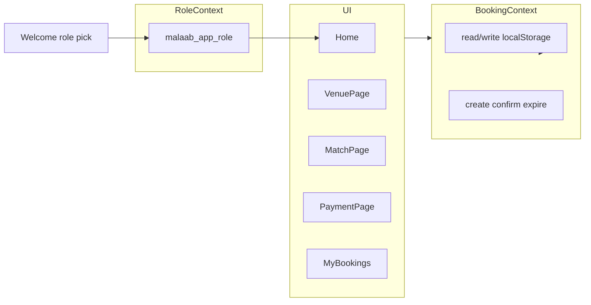

# Malaab (ملاعب) — implementation plan

## Context

- **Directory:** [`/Users/omarbrome/Documents/Codes/ai-playground/football_hajez_app`](/Users/omarbrome/Documents/Codes/ai-playground/football_hajez_app) — currently **empty** (greenfield).
- **Reference stack** in-repo: [`paypal_dhl`](/Users/omarbrome/Documents/Codes/ai-playground/paypal_dhl) uses Vite 8, React 19, `@tailwindcss/vite` + Tailwind 4, `react-router-dom` v6 — mirror this setup for consistency and fewer surprises.

## 1a. Dual persona — “who are you?” (Player vs Pitch Host)

**Idea:** On first open (and optionally “Switch role” in settings later), the user picks how they use ملاعب:

| Persona | English name (recommended) | Arabic hint | What they do |
|--------|---------------------------|---------------|----------------|
| **Player** | **Player** | لاعب | Books a **position** on an existing upcoming match, pays their share, shows up to play. |
| **Field renter / organizer** | **Pitch Host** (preferred over “field renter”) | مضيف الملعب · أو منظم الجلسة | Rented the **pitch for that time slot** and is responsible for **filling the team** / coordinating players—not necessarily playing every position themselves. |

**Why “Pitch Host”:** Short, athletic, and reads like hospitality + ownership of the session. Alternatives if you want a more literal tone: **Session Organizer** (منظم الجلسة), **Slot Lead** (مسؤول الحجز). Avoid vague labels like “Renter” in the UI; keep “renter” only in internal comments if needed.

**UX:**

- **`/welcome`** (or a full-screen **RolePicker** before any other route): two large tappable cards with icon + title + one-line subtitle:
  - *Player* — “Book your spot on a match.”
  - *Pitch Host* — “You’ve got the field—gather your squad.”
- Persist choice in **`localStorage` key `malaab_app_role`** with values `'player' | 'pitch_host'`.
- **`RoleContext`** (or extend a thin `AppContext`): `role`, `setRole`, `clearRole` (for “Switch role” in profile/menu).
- **Route gate:** If `malaab_app_role` is missing, redirect any deep link to `/welcome` first; after selection, `navigate` intended path or `/`.
- **Bottom nav / header:** Subtle chip or label: “Playing” vs “Hosting” so the mode is always obvious.

**Pitch Host mode — v1 scope (demo-friendly):**

- Same **browse venues / matches** is still useful (scouting slots, sharing links with friends).
- **Host-specific home block:** e.g. “Sessions you’re hosting” with empty state + short copy: *“Soon: list your rental slot and invite players.”* (No new backend—placeholder only unless you later add `malaab_host_sessions` in LS.)
- **Player-only emphasis:** default hero on Home stays booking-first for **Player**; for **Host**, hero prioritizes the hosting empty state, then “Browse pitches” below.

**Implementation files (add to tree):**

- [`src/pages/Welcome.tsx`](file:///Users/omarbrome/Documents/Codes/ai-playground/football_hajez_app/src/pages/Welcome.tsx) — role selection screen.
- [`src/components/RolePicker.tsx`](file:///Users/omarbrome/Documents/Codes/ai-playground/football_hajez_app/src/components/RolePicker.tsx) — two-card UI (can be inlined in Welcome).
- [`src/context/RoleContext.tsx`](file:///Users/omarbrome/Documents/Codes/ai-playground/football_hajez_app/src/context/RoleContext.tsx) + hook.

**Booking model note:** Existing `Booking` flow remains **player-centric** (position + phone). Pitch Host does not need a separate booking type for v1; future work could add “host-created match” records in `malaab_matches`.

## 1. Project scaffold

- Initialize Vite **React + TypeScript** in `football_hajez_app` (same major versions as `paypal_dhl` where practical).
- Add **Tailwind v4** via `@tailwindcss/vite` in [`vite.config.ts`](file:///Users/omarbrome/Documents/Codes/ai-playground/football_hajez_app/vite.config.ts) and a single [`src/index.css`](file:///Users/omarbrome/Documents/Codes/ai-playground/football_hajez_app/src/index.css) with `@import 'tailwindcss'` + `@theme` tokens:
  - Background: `#0a0e1a`, accent: `#00d96d`, text: white, Whish accent: `#e91e8c`.
  - **Inter** via Google Fonts in [`index.html`](file:///Users/omarbrome/Documents/Codes/ai-playground/football_hajez_app/index.html) (`preconnect` + `family=Inter` weights 400, 700, 900).
- ESLint/TS config aligned with Vite template (no extra scope).
- **No axios** unless needed — all persistence is `localStorage`.

## 2. Routing and layout

[`src/App.tsx`](file:///Users/omarbrome/Documents/Codes/ai-playground/football_hajez_app/src/App.tsx):

- Wrap app in `BrowserRouter` + **`RoleProvider`** (§1a) + **`BookingProvider`** (see §4).
- Routes:
  - `/welcome` → `Welcome` (role selection; skip if `malaab_app_role` already set when using optional “remember” behavior—still allow revisiting via “Switch role”).
  - `/` → `Home` (content varies slightly by `role`; see §1a)
  - `/venue/:venueId` → `VenuePage`
  - `/match/:matchId` → `MatchPage`
  - `/payment/:bookingId` → `PaymentPage` (handles countdown, expire redirect, demo confirm → success UI; can render `BookingConfirmation` as the success step or inline).
  - `/bookings` → `MyBookings`
  - Catch-all → simple `NotFound` or redirect home.

**Mobile shell:** a layout component (or inline in `App`) that renders `<Outlet />` + **fixed bottom nav** (Home, My Bookings) with `pb-safe` / padding so content clears the bar on notched phones. Hide or soften bottom nav on very large breakpoints if desired; primary target **375px**.

## 3. Data model and mock seed

[`src/data/mockData.ts`](file:///Users/omarbrome/Documents/Codes/ai-playground/football_hajez_app/src/data/mockData.ts):

- Export `venues` and base `matches` exactly as specified (IDs, prices, spot structure).
- **Booked slot shape** (extends your empty `booked` arrays): `{ bookingId: string; playerName: string; phone: string; status: 'pending' | 'confirmed' }` so the field can show names and pending vs confirmed.
- **Venue images:** for `"stadium photo"` / empty strings, use a **placeholder**: e.g. gradient + initials, or one royalty-free stadium image URL in `public/` — avoid broken `image: ""` UX.
- **Mock dates:** your sample uses `2025-05-10` — for a demo in **2026**, bump dates to upcoming weekends (e.g. May 2026) so “upcoming matches” and conflict logic feel real; still use the same venue/match graph.

**Types:** [`src/types/booking.ts`](file:///Users/omarbrome/Documents/Codes/ai-playground/football_hajez_app/src/types/booking.ts) (and match/venue types) so context and components stay typed.

## 4. localStorage layer and context

[`src/utils/localStorage.ts`](file:///Users/omarbrome/Documents/Codes/ai-playground/football_hajez_app/src/utils/localStorage.ts):

- Keys: `malaab_matches`, `malaab_bookings`, `malaab_timers`, **`malaab_app_role`** (see §1a).
- Safe `JSON.parse` with fallbacks; versioned optional migration not required for v1.
- **Initialization:** on first load, if `malaab_matches` missing, **deep-clone** `mockData` matches into storage so mutations never corrupt the module default.

[`src/context/BookingContext.tsx`](file:///Users/omarbrome/Documents/Codes/ai-playground/football_hajez_app/src/context/BookingContext.tsx):

- State: matches (with spots), bookings array, timers map (optional mirror of `expiresAt` for debugging; **source of truth for countdown** = `booking.expiresAt` and/or `malaab_timers[bookingId]` — keep them in sync on write).
- Actions (conceptually):
  - `getVenue`, `getMatch`, list matches by venue.
  - **`createPendingBooking`**: validate phone not already on same spot/match; add booking `BK-${Date.now()}`; push `expiresAt = bookedAt + 15m`; reserve spot on match as **pending** (yellow for others); write all three keys.
  - **`confirmBookingDemo`**: set booking `confirmed`, update match spot entry to `confirmed`.
  - **`expireBooking`**: set `expired`, remove pending hold from match spot, update storage; used by timer and on payment page load if already expired.

Expose a small hook `useBooking()` from the same file or `useBooking.ts` next to it.

## 5. Conflict and overlap rules

[`src/utils/conflictCheck.ts`](file:///Users/omarbrome/Documents/Codes/ai-playground/football_hajez_app/src/utils/conflictCheck.ts):

- Normalize **match start** as a `Date` in **Asia/Beirut** (parse `date` + `time` as local Beirut wall time, e.g. build ISO with offset or use a small helper with `Temporal` avoided for compatibility — `Intl` + manual parse of `YYYY-MM-DD` and `HH:mm` as Beirut is enough).
- **Overlap rule:** ±2 hours from new match start vs each **existing** booking for same `phone` where status is `pending` or `confirmed` (exclude `expired`).
- Return structured error for UI: existing match’s time/date for the message you specified.

**Same match twice:** reject if `phone` already has any non-expired booking for that `matchId` (in addition to overlap rule).

## 6. Pages (behavior summary)

| Route | Behavior |
|-------|----------|
| [`Home.tsx`](file:///Users/omarbrome/Documents/Codes/ai-playground/football_hajez_app/src/pages/Home.tsx) | Brand: **ملاعب** + subtitle “Malaab” / tagline “Book your spot. Own the pitch.” (tweak tagline for **Pitch Host**: e.g. “Your pitch. Your squad.”); **Host** sees hosting empty state first, then venue grid; **Player** sees venue grid as today. |
| [`Welcome.tsx`](file:///Users/omarbrome/Documents/Codes/ai-playground/football_hajez_app/src/pages/Welcome.tsx) | First-run (or explicit) **Player** vs **Pitch Host** choice; persist `malaab_app_role`; continue to `/`. |
| [`VenuePage.tsx`](file:///Users/omarbrome/Documents/Codes/ai-playground/football_hajez_app/src/pages/VenuePage.tsx) | Resolve venue; list `MatchCard` components; compute **spots left** from spot totals minus booked (pending + confirmed); **Full** badge when 0; Book Now → `/match/:id`. |
| [`MatchPage.tsx`](file:///Users/omarbrome/Documents/Codes/ai-playground/football_hajez_app/src/pages/MatchPage.tsx) | Details + `SoccerField`; selection opens bottom sheet with `BookingForm` trigger; navigate to `/payment/:bookingId` after successful form submit. |
| [`PaymentPage.tsx`](file:///Users/omarbrome/Documents/Codes/ai-playground/football_hajez_app/src/pages/PaymentPage.tsx) | Summary; Whish block (text/wordmark logo in brand color — no official asset required); [`CountdownTimer`](file:///Users/omarbrome/Documents/Codes/ai-playground/football_hajez_app/src/components/CountdownTimer.tsx) from persisted expiry; on 0 → expire + **replace** navigate to `/match/:matchId`; demo “Mark as Paid” → confirmed + success UI ([`BookingConfirmation.tsx`](file:///Users/omarbrome/Documents/Codes/ai-playground/football_hajez_app/src/pages/BookingConfirmation.tsx) as child or route fragment). |
| [`MyBookings.tsx`](file:///Users/omarbrome/Documents/Codes/ai-playground/football_hajez_app/src/pages/MyBookings.tsx) | All bookings on device; badges via `StatusBadge`; pending shows remaining time + link to `/payment/:id`; confirmed shows **QR-style** reference (CSS grid of squares encoding a hash of `id` + short alphanumeric — no extra npm package unless you prefer `qrcode.react`). |

## 7. Soccer field (centerpiece)

[`src/components/SoccerField.tsx`](file:///Users/omarbrome/Documents/Codes/ai-playground/football_hajez_app/src/components/SoccerField.tsx):

- Single SVG with **`viewBox`** (e.g. `0 0 100 160` portrait pitch — goals top/bottom), `preserveAspectRatio="xMidYMid meet"`, width `100%` in a constrained aspect container so it **scales on mobile**.

Pitch drawing (all in SVG):

- Green fill, white stroke for touchlines, halfway, center circle, penalty boxes, goals.

[`src/components/PositionNode.tsx`](file:///Users/omarbrome/Documents/Codes/ai-playground/football_hajez_app/src/components/PositionNode.tsx):

- **Two layout maps** keyed by match type (`5-a-side` vs `7-a-side`): normalized `{ x, y }` in viewBox coords for each **position key** in mock data (GK bottom center; defenders bottom third; mids middle; attackers top third; striker top center — wingers wide).
- Render `<g>` with circle **≥ 44px equivalent** at typical phone width (compute `r` from viewBox vs rendered size, or use large `r` in user units ~4–5% of field height).
- States: available (green + CSS pulse), booked red (show `title` / `aria-label` + tap tooltip on mobile via small state), pending yellow, selected blue ring.
- Labels below nodes (short Arabic/English labels per key — can match keys to display names in a map).

Interaction: controlled `selectedPosition` in `MatchPage`; only **available** nodes set selection.

## 8. UI components

- [`VenueCard.tsx`](file:///Users/omarbrome/Documents/Codes/ai-playground/football_hajez_app/src/components/VenueCard.tsx) / [`MatchCard.tsx`](file:///Users/omarbrome/Documents/Codes/ai-playground/football_hajez_app/src/components/MatchCard.tsx): hover **green glow** (`shadow-[0_0_20px_rgba(0,217,109,0.25)]` etc.), rounded cards, bold typography.
- [`BookingForm.tsx`](file:///Users/omarbrome/Documents/Codes/ai-playground/football_hajez_app/src/components/BookingForm.tsx): bottom sheet (slide-up panel + backdrop), full name, phone (normalize to `+961` prefix in display/validation), confirm runs conflict + duplicate checks then `createPendingBooking` + `navigate`.
- [`CountdownTimer.tsx`](file:///Users/omarbrome/Documents/Codes/ai-playground/football_hajez_app/src/components/CountdownTimer.tsx): `useEffect` + `setInterval` 1s; `remaining = Math.max(0, expiresAt - Date.now())`; `clearInterval` on unmount; MM:SS display.
- [`StatusBadge.tsx`](file:///Users/omarbrome/Documents/Codes/ai-playground/football_hajez_app/src/components/StatusBadge.tsx): green / yellow / red per status.

## 9. Formatting helpers

- **LBP:** `formatLbp(n)` → `50,000 LBP` via `Intl.NumberFormat('en-US')` or `en-LB` with `maximumFractionDigits: 0`.
- **Date/time:** `Intl.DateTimeFormat('en-GB', { timeZone: 'Asia/Beirut', ... })` for date and time strings on cards and payment.

## 10. Data flow (high level)

## 11. README (minimal)

- One short [`README.md`](file:///Users/omarbrome/Documents/Codes/ai-playground/football_hajez_app/README.md) in the new app: `npm install`, `npm run dev`, note that data is device-local and Whish is demo-only.

## 12. Future backend swap

- Keep all mutations behind **context methods** that read/write storage today; pages call context only — no direct `localStorage` in page components except where unavoidable (prefer none).

## Risk / complexity notes

- **Beirut datetime parsing:** keep helpers in `utils/` and unit-test mentally for DST edge (Lebanon has had DST changes — `Intl` display is fine; parsing `YYYY-MM-DD` + `HH:mm` as local is acceptable for a demo).
- **SVG + touch:** large hit targets and `pointer-events` on groups; test on narrow viewport.
