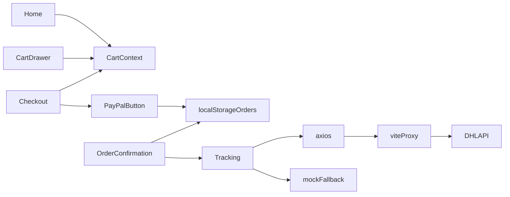

# Lumière demo e‑commerce app

## Placement and scaffold

Create a **standalone** app at **[`/Users/omarbrome/Documents/Codes/ai-playground/paypal_dhl`](/Users/omarbrome/Documents/Codes/ai-playground/paypal_dhl)** (create the folder when scaffolding if it does not exist) so it does not mix with [`snack_nasab`](/Users/omarbrome/Documents/Codes/ai-playground/snack_nasab) or the monolithic [`package.json`](/Users/omarbrome/Documents/Codes/package.json) at `Codes/` root.

When running `npm create vite@latest`, pass this path as the project directory **or** create the repo inside `paypal_dhl` via `.` after `cd` into that folder.

1. Run `npm create vite@latest` → React + TypeScript template.
2. Add deps: `react-router-dom`, `axios`, `tailwindcss` (+ PostCSS/autoprefixer), optionally `clsx` for conditional classes if useful (keep minimal).
3. Configure Tailwind (`tailwind.config.ts`, `postcss.config.js`, [`src/index.css`](/Users/omarbrome/Documents/Codes/ai-playground/paypal_dhl/src/index.css)): extend theme with palette `#1a1714`, `#f5efe6`, `#c9a96e`; enable `@tailwind base/components/utilities`.

## Typography and global atmosphere

- In [`index.html`](/Users/omarbrome/Documents/Codes/ai-playground/paypal_dhl/index.html): add Google Fonts link for **Playfair Display** + **DM Sans** (weights used on headings vs body).
- Base layout: body background charcoal, text cream; avoid flat white.
- **Grain overlay**: fixed full-viewport `::before` or a root `<div>` with `pointer-events-none`, `opacity` ~0.04–0.08, `background-image` from a tiny base64 noise or CSS `repeating-linear-gradient` / SVG filter — cheap and no asset hosting.
- **Candlelight glow**: radial gradients on hero/sections and soft `box-shadow` on cards/buttons using gold at low alpha.
- **Motion**: CSS `@keyframes` fade-in + `animation-delay` stagger on product cards; optional `view-transition` or simple opacity/transform on route wrapper (keep dependency-free where possible).

## App shell and routing

[`src/App.tsx`](/Users/omarbrome/Documents/Codes/ai-playground/paypal_dhl/src/App.tsx):

- `BrowserRouter` with routes:
  - `/` → `Home`
  - `/checkout` → `Checkout`
  - `/order-confirmation/:orderId` → `OrderConfirmation`
  - `/tracking/:trackingNumber` → `Tracking`
  - `*` → `NotFound` (404)
- Wrap routes in **`<Suspense fallback={...}>`** and use **`React.lazy(() => import('./pages/...'))`** for all page components (per spec).
- Shared layout: [`Navbar`](/Users/omarbrome/Documents/Codes/ai-playground/paypal_dhl/src/components/Navbar.tsx) + outlet area; persist [`CartDrawer`](/Users/omarbrome/Documents/Codes/ai-playground/paypal_dhl/src/components/CartDrawer.tsx) at layout level (open state local to layout or small UI context — cart *data* stays in `CartContext`).

## Data and catalog

- [`src/data/products.ts`](/Users/omarbrome/Documents/Codes/ai-playground/paypal_dhl/src/data/products.ts): export the provided `products` array as typed `Product[]` (ids `c1`–`c8`). Note: `c2` and `c8` share the same Unsplash URL in the spec; optional one-line fix to a different candle image for variety (non-blocking).

## Cart: Context + reducer + persistence

[`src/context/CartContext.tsx`](/Users/omarbrome/Documents/Codes/ai-playground/paypal_dhl/src/context/CartContext.tsx):

- `useReducer` with actions: `ADD_ITEM`, `REMOVE_ITEM`, `UPDATE_QTY`, `CLEAR_CART`.
- State shape: line items `{ product, quantity }` (or id + denormalized fields); derive subtotal in selectors/helpers.
- **localStorage**: e.g. key `lumiere_cart_v1` — `useEffect` to load on mount; persist on every state change (guard SSR — Vite CSR only, so `typeof window` is enough).
- [`CartDrawer`](/Users/omarbrome/Documents/Codes/ai-playground/paypal_dhl/src/components/CartDrawer.tsx): slide-in panel (fixed, `translate-x`, backdrop), qty `/`–`+`, remove, subtotal, **$8 shipping** line, total, “Proceed to Checkout” → `navigate('/checkout')`.
- [`Navbar`](/Users/omarbrome/Documents/Codes/ai-playground/paypal_dhl/src/components/Navbar.tsx): “Lumière” wordmark, link home, cart icon with **badge** = total item count, visible **“Demo Mode”** pill.

## Home page and loading UX

[`src/pages/Home.tsx`](/Users/omarbrome/Documents/Codes/ai-playground/paypal_dhl/src/pages/Home.tsx):

- **Suspense** already wraps lazy pages; add an **intentional short delay** only if you want skeletons to be visible — better: local `useState` + `useEffect` ~400–800ms “fetch simulation” before showing grid so [`ProductGridSkeleton`](/Users/omarbrome/Documents/Codes/ai-playground/paypal_dhl/src/components/ProductGridSkeleton.tsx) (small new component or inline in `Home`) actually appears.
- Grid: responsive 1→2→3–4 columns; [`ProductCard`](/Users/omarbrome/Documents/Codes/ai-playground/paypal_dhl/src/components/ProductCard.tsx): image (object-cover), name, scent, price, **Add to Cart**; stagger animation class per index.

## Checkout + PayPal

[`src/pages/Checkout.tsx`](/Users/omarbrome/Documents/Codes/ai-playground/paypal_dhl/src/pages/Checkout.tsx): two-column responsive layout — order summary left, PayPal area right.

[`src/components/PayPalButton.tsx`](/Users/omarbrome/Documents/Codes/ai-playground/paypal_dhl/src/components/PayPalButton.tsx):

- **Script loading**: Vite does **not** replace `import.meta.env` inside static `index.html` by default. Recommended: **inject** `<script src="https://www.paypal.com/sdk/js?client-id=...&currency=USD">` from the component (`useEffect`), keyed on `import.meta.env.VITE_PAYPAL_CLIENT_ID`, then `window.paypal.Buttons({ createOrder, onApprove, onError })` **`.render('#paypal-button-container')`**; cleanup on unmount if needed.
- `createOrder`: return PayPal order id from actions (sandbox).
- `onApprove(data)`: read `data.orderID`, `data.payerID`; build persisted order:

```ts
{
  orderId: "PAY-" + Date.now(),
  paypalOrderId: data.orderID,
  items: cartItems,
  total: totalAmount,
  status: "paid",
  trackingNumber: "JD014600006251903756",
  createdAt: new Date().toISOString(),
}
```

- **Orders storage**: append to JSON array under e.g. `lumiere_orders_v1` in localStorage (enables confirmation lookup by `:orderId`).
- `CLEAR_CART`, `navigate('/order-confirmation/' + orderId)`.

[`.env.example`](/Users/omarbrome/Documents/Codes/ai-playground/paypal_dhl/.env.example): document `VITE_PAYPAL_CLIENT_ID` and `VITE_DHL_API_KEY`.

## Order confirmation

[`src/pages/OrderConfirmation.tsx`](/Users/omarbrome/Documents/Codes/ai-playground/paypal_dhl/src/pages/OrderConfirmation.tsx):

- Read `orderId` from `useParams()`, find matching object in localStorage; if missing → friendly empty state + link home.
- Show success copy, line items, totals, **tracking number** prominent, CTA **Track My Order** → `/tracking/:trackingNumber`.

## DHL tracking + CORS reality

Calling `https://api-eu.dhl.com/track/shipments` **from the browser** will usually fail with **CORS**. To honor “sandbox API calls” in dev without a backend:

- Add **Vite dev proxy** in [`vite.config.ts`](/Users/omarbrome/Documents/Codes/ai-playground/paypal_dhl/vite.config.ts):

```ts
server: {
  proxy: {
    '/api/dhl': {
      target: 'https://api-eu.dhl.com',
      changeOrigin: true,
      rewrite: (p) => p.replace(/^\/api\/dhl/, ''),
    },
  },
},
```

- [`src/pages/Tracking.tsx`](/Users/omarbrome/Documents/Codes/ai-playground/paypal_dhl/src/pages/Tracking.tsx): `axios.get('/api/dhl/track/shipments', { params: { trackingNumber }, headers: { 'DHL-API-Key': import.meta.env.VITE_DHL_API_KEY } })` in dev; for **production static deploy** without a proxy, either document “use mock only” or try direct URL and **always** fall back on network/CORS/empty errors.

Parsing (defensive optional chaining):

- `shipments[0].status.description`
- `shipments[0].status.location.address.addressLocality`
- `shipments[0].events` for timeline

[`src/components/TrackingTimeline.tsx`](/Users/omarbrome/Documents/Codes/ai-playground/paypal_dhl/src/components/TrackingTimeline.tsx):

- Map API events → unified `{ timestamp, location, description, status }`; sort **most recent first**.
- On error/empty: use provided **mockEvents** (update year in mock timestamps to **2026** to match your environment date if you want consistency).
- Vertical timeline: line + nodes; icons by `status` (`transit`, `out-for-delivery`, `delivered`).
- Show **estimated delivery** (from API field if present, else derive from last mock event date or copy).
- **DHL badge**: official logo as small static asset in `public/` (download allowed trademark use for integration) or text “DHL Express” with brand yellow accent — pick one and keep it tasteful.

## 404 and polish

- [`src/pages/NotFound.tsx`](/Users/omarbrome/Documents/Codes/ai-playground/paypal_dhl/src/pages/NotFound.tsx): on-brand minimal page + link home.
- README: how to set env vars, run dev server, note PayPal sandbox + DHL sandbox keys, and that **DHL requires the Vite proxy in dev** for browser calls.

## Dependency flow (mermaid)


