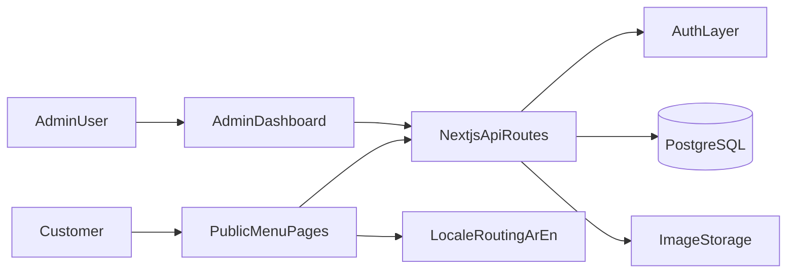

# Snack Nasab Web App Implementation Plan

## Goal
Create a production-ready, mobile-responsive web application for Snack Nasab that supports Arabic and English, presents the menu clearly, includes inviting animations, and provides a full admin dashboard for menu/content management.

## Product Scope
- Public customer-facing website:
  - Landing section (brand, welcome message, CTA to menu)
  - Menu sections and items (Arabic/English localized)
  - Optional contact/order info block (phone and location)
- Admin dashboard:
  - Secure login
  - CRUD for categories and menu items
  - Upload/manage item images
  - Toggle availability/featured state
  - Manage bilingual text for all menu fields
- Shared requirements:
  - RTL/LTR switching with language toggle
  - Mobile-first responsive layout
  - Accessible, fast, and SEO-friendly

## Recommended Architecture
- Framework: Next.js App Router + TypeScript
- Styling/UI: Tailwind CSS + shadcn/ui
- Animation: Framer Motion (subtle, performance-safe)
- Data layer: PostgreSQL + Prisma ORM
- Auth/Admin security: NextAuth (Credentials) or Clerk (if preferred)
- File storage: local for dev, cloud (e.g., Cloudinary/S3) for production
- i18n: next-intl with locale routes (`/ar`, `/en`)



## Project Structure (planned)
- [`/Users/omarbrome/Documents/Codes/ai-playground/snack_nasab/src/app`]( /Users/omarbrome/Documents/Codes/ai-playground/snack_nasab/src/app )
  - Public pages, locale-aware routing, API routes
- [`/Users/omarbrome/Documents/Codes/ai-playground/snack_nasab/src/components`]( /Users/omarbrome/Documents/Codes/ai-playground/snack_nasab/src/components )
  - Reusable UI blocks (hero, language switcher, item cards, section headers)
- [`/Users/omarbrome/Documents/Codes/ai-playground/snack_nasab/src/lib`]( /Users/omarbrome/Documents/Codes/ai-playground/snack_nasab/src/lib )
  - i18n helpers, data mappers, validation schemas
- [`/Users/omarbrome/Documents/Codes/ai-playground/snack_nasab/prisma`]( /Users/omarbrome/Documents/Codes/ai-playground/snack_nasab/prisma )
  - Database schema and migrations
- [`/Users/omarbrome/Documents/Codes/ai-playground/snack_nasab/src/messages`]( /Users/omarbrome/Documents/Codes/ai-playground/snack_nasab/src/messages )
  - UI translation files (`ar.json`, `en.json`)

## Data Model (admin-ready)
- `Category`
  - `id`, `slug`, `nameAr`, `nameEn`, `sortOrder`, `isActive`
- `MenuItem`
  - `id`, `categoryId`, `nameAr`, `nameEn`, `descriptionAr`, `descriptionEn`, `price`, `currency`, `imageUrl`, `isAvailable`, `isFeatured`, `sortOrder`
- `SiteSetting`
  - `id`, `phone`, `welcomeTextAr`, `welcomeTextEn`, `brandAssets`
- `AdminUser`
  - `id`, `email`, `passwordHash`, `role`

## UX/UI Plan
- Visual direction:
  - Warm, appetizing palette inspired by menu image accents
  - High readability Arabic typography with proper line-height
  - Clean card-based layout and sticky category filter on mobile
- Interaction:
  - Language switcher fixed in header
  - Smooth section transitions and subtle card entrance animations
  - Skeleton loading states and clear empty/error states
- Accessibility:
  - Minimum AA contrast
  - Keyboard focus support in both public and admin pages
  - Semantic headings for screen readers

## i18n + RTL/LTR Plan
- Locale routes: `/ar` and `/en`
- Language switch preserves current page context
- `dir="rtl"` for Arabic and `dir="ltr"` for English
- Dual-language fields required in admin forms
- Fallback strategy: if one language is missing, show configured fallback text in admin preview only (not public, unless explicitly enabled)

## Delivery Milestones
1. Foundation setup and shared design system
2. Public bilingual menu pages with responsive layout
3. Admin authentication and dashboard shell
4. Category/item CRUD with bilingual forms and validation
5. Media upload integration and availability controls
6. Final UX polish, animation tuning, SEO/accessibility pass, QA

## QA and Acceptance Criteria
- Mobile-first behavior verified on common breakpoints
- Arabic and English switch works globally and updates direction
- Admin can create/edit/delete categories and items without code changes
- Public menu reflects admin updates correctly
- Performance target: good Lighthouse mobile score on core pages
- No blocking console/runtime errors in production build

## Prompt To Generate The Web App
Use this prompt directly with a coding agent:

```text
Build a production-ready web application for a fast food restaurant called “Snack Nasab” in this folder:
/Users/omarbrome/Documents/Codes/ai-playground/snack_nasab

Requirements:
1) Tech stack:
- Next.js (App Router) + TypeScript
- Tailwind CSS for styling
- Framer Motion for subtle animations
- Prisma + PostgreSQL
- Admin auth (secure login) using NextAuth credentials

2) Product features:
- Public customer-facing website for menu browsing
- Full admin dashboard to manage menu categories and items
- Bilingual support: Arabic + English
- Language switcher visible and easy to use
- Proper RTL support for Arabic and LTR support for English
- Mobile-first responsive design
- Clear, simple, welcoming UI/UX with smooth but lightweight animations

3) Content model:
- Categories and menu items must support bilingual fields:
  - category: nameAr, nameEn
  - item: nameAr, nameEn, descriptionAr, descriptionEn, price, image, availability, featured
- Add sort order controls for categories and items
- Admin can toggle active/available status

4) Public pages:
- Home/landing with brand identity and welcome message
- Menu page with category sections and item cards
- Optional contact/order section with phone and social links

5) Admin dashboard:
- Login page
- Category CRUD
- Item CRUD
- Image upload support (local development storage acceptable; abstraction for cloud storage)
- Form validation with useful error messages

6) i18n behavior:
- Locale routes: /ar and /en
- Language switch should preserve current route context
- Automatically set html dir and text alignment based on locale

7) Quality constraints:
- Accessible UI (semantic structure, keyboard-friendly controls, readable contrast)
- Reusable components and clean architecture
- Strong TypeScript typing
- Add seed script with initial bilingual menu data based on attached Snack Nasab menu image
- Include setup instructions in README (install, env, db migration, seed, run)

8) Deliverables:
- Complete runnable codebase
- Prisma schema + migrations + seed
- Public pages + admin dashboard
- i18n config and translation files
- README with local run steps and deployment notes

Also implement tasteful animations only where they improve UX (hero entrance, card fade/slide, button feedback). Avoid heavy effects that hurt performance.
```

## Notes For Content Migration From Image
- First seed pass should include exact Arabic names/prices from the menu image.
- English text can start as practical transliterations/translations and be edited from admin later.
- Keep all seeded content editable in admin so business owners can refine wording and prices quickly.